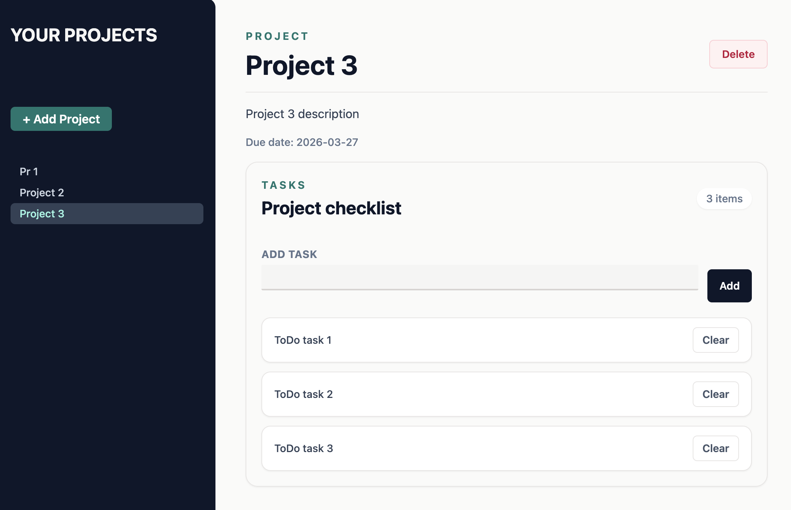

# Project Management App

A small SPA for managing projects and tasks, built with `React + TypeScript + Vite`. The application lets users create projects, switch between them, add tasks, and delete both individual tasks and entire projects.



## Features

- create a new project with a title, description, and due date
- validate project titles for empty values and duplicates
- show validation errors in a modal built with `forwardRef`, `useImperativeHandle`, and `createPortal`
- display all projects in the sidebar
- open a selected project and view its details
- add tasks to a project
- prevent empty and duplicate tasks
- delete individual tasks
- delete a project

## Tech Stack

- React 19
- TypeScript
- Vite
- Tailwind CSS
- ESLint
- Prettier

## Getting Started

Requirements:

- Node.js 18+
- npm

Install dependencies:

```bash
npm install
```

Start the development server:

```bash
npm run dev
```

Build for production:

```bash
npm run build
```

Preview the production build locally:

```bash
npm run preview
```

Run the linter:

```bash
npm run lint
```

Format the codebase:

```bash
npm run format
```

## Project Structure

The app stores its state locally in `App.tsx` using `useState`, with no backend and no `localStorage` persistence. This means the project and task list resets after a page refresh.

Main parts:

- `src/App.tsx` - root component and shared state management
- `src/components/SideBar.tsx` - project list and create button
- `src/components/AddProjectPage.tsx` - project creation form
- `src/components/ProjectPage.tsx` - project details and task management
- `src/components/Modal.tsx` - modal rendered through a portal
- `src/components/NoProjectsPage.tsx` - empty state screen
- `src/models/ProjectCodable.d.ts` - project and task types

## Implementation Notes

- A project is identified by its `title`, so each title must be unique.
- The modal uses a dedicated `#modal-root` DOM node in `index.html`.
- Tasks inside a project are also validated for unique text values.

## Possible Improvements

- persist data in `localStorage` or connect a backend API
- add project and task editing
- add task completion status
- implement project filtering and sorting
- cover key flows with tests
